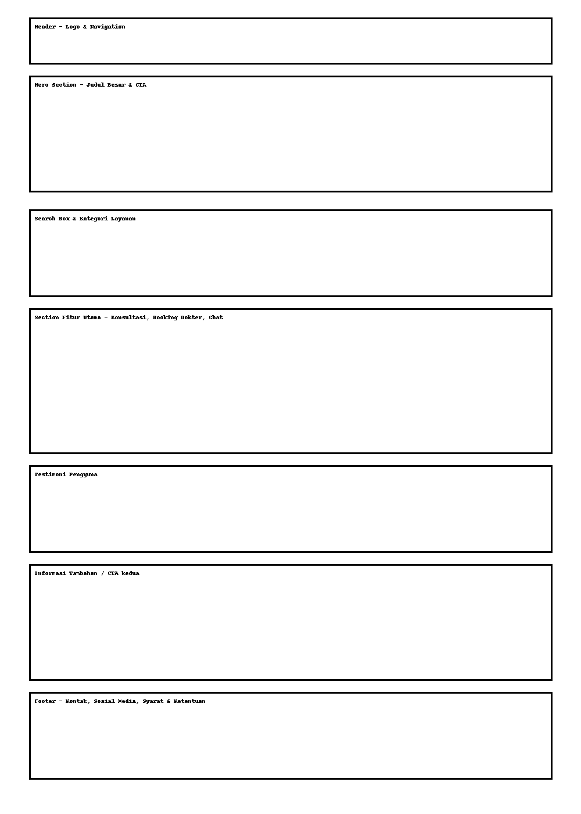

# Aplikasi Konsultasi Kesehatan - UI/UX dan Desain Grafis

## Studi Kasus
Sebuah startup ingin meluncurkan aplikasi web layanan konsultasi kesehatan. Mereka ingin memastikan tampilan web yang menarik sekaligus mudah digunakan.

## Prinsip UI/UX

- **Konsistensi:** Desain dan elemen antarmuka harus seragam agar pengguna tidak bingung.
- **Keterbacaan:** Gunakan font yang jelas dan ukuran teks yang cukup besar.
- **Navigasi yang jelas:** Menu dan tombol harus mudah ditemukan.
- **Responsif:** Tampilan harus menyesuaikan perangkat (mobile/desktop).
- **Aksesibilitas:** Gunakan warna dan kontras yang mudah dilihat semua pengguna.

## Dasar Desain Grafis

- **Hierarki Visual:** Elemen penting seperti CTA (Call-to-Action) harus lebih menonjol.
- **Kontras:** Gunakan warna kontras untuk membedakan elemen penting (contoh: tombol biru di atas background putih).
- **Whitespace:** Gunakan ruang kosong untuk membuat tampilan lebih lega dan tidak penuh sesak.

## Wireframe Homepage

Berikut adalah wireframe kasar untuk halaman utama aplikasi layanan konsultasi kesehatan. Anotasi telah ditambahkan untuk menjelaskan bagian-bagian penting.

